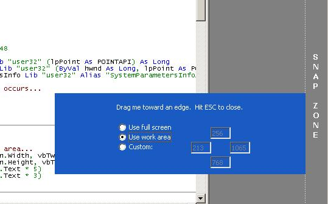



## Create custom snap areas for your VB forms \(Updated\)

### Description

Snapping a form to the edge of the screen is easy enough in VB... that is, if you don't mind subclassing. If you'd rather not have to worry about subclassing and the pitfalls involved then these solutions may work for you.

The implementation issue with VB is that it provides no mechanism for determining when you've clicked on the caption bar. The two examples presented in this article show how you can overcome this limitation in a couple of ways without resorting to subclassing.

The first example, "Snap with Caption using Timer", shows how you can use a standard VB Timer control to determine when the mouse is requesting a form to move. The form's Moveable property is set to False at design-time and all movements are handled by our code. This allows us to take full control over positioning and snapping behavior.

The second example, "Custom Snap Areas", demonstrates how snapping can be done without a Timer, so long as you don't mind having a captionless form. This example also demonstrates setting up custom snap areas independent of the screen size.

Thanks for reading and I hope you find my code useful.
 
### More Info
 

             |
---                |---
**Submitted On**   |2011-10-07 13:06:24
**By**             |[Slaystation](https://github.com/Planet-Source-Code/PSCIndex/blob/master/ByAuthor/slaystation.md)
**Level**          |Intermediate
**User Rating**    |5.0 (15 globes from 3 users)
**Compatibility**  |VB 5\.0, VB 6\.0
**Category**       |[Custom Controls/ Forms/  Menus](https://github.com/Planet-Source-Code/PSCIndex/blob/master/ByCategory/custom-controls-forms-menus__1-4.md)
**World**          |[Visual Basic](https://github.com/Planet-Source-Code/PSCIndex/blob/master/ByWorld/visual-basic.md)
**Archive File**   |[Create\_cus2212401072011\.zip](https://github.com/Planet-Source-Code/slaystation-create-custom-snap-areas-for-your-vb-forms-updated__1-74122/archive/master.zip)

